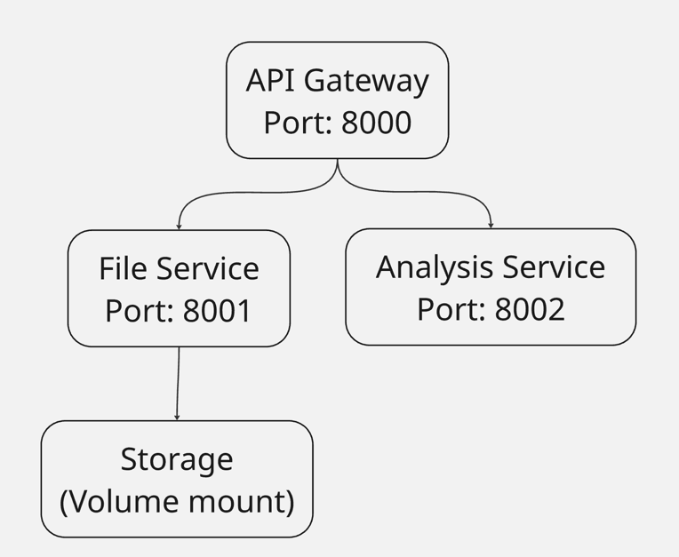

# AntiPlaga - Система антиплагиата

Микросервисная система для контроля студенческих работ на плагиат с использованием алгоритма k-shingling и коэффициента Jaccard. Находит работу с которой было вероятнее всего сплагиачено и выводит коэффициент сходства

## Архитектура



### Компоненты системы:

#### 1. API Gateway (порт 8000)
- Единая входная точка
- Маршрутизация запросов между сервисами
- Агрегация результатов

#### 2. File Service (порт 8001)
- Хранит файлы с кодом
- Структурный анализ (сколько строк кода, комментов)
- Получает и выдает файлы другим двум сервисам

#### 3. Analysis Service (порт 8002)
- Обнаружение плагиата методом k-shingling
- Вычисление коэффициента Jaccard
- Генерация отчетов о плагиате


## Алгоритм антиплагиата

### Уровень 1: Структурный анализ
Анализируются метрики кода:
- Размер файла в байтах
- Количество строк кода
- Количество комментариев
- Соотношение комментариев к коду
Базовая проверка на "макро"-плагиат

### Уровень 2: K-Shingling + Jaccard Similarity

**Шаг 1: Нормализация кода**
- Удаление комментариев (#, //, /* */)
- Приведение к нижнему регистру
- Удаление лишних пробелов

**Шаг 2: Генерация k-шинглов (k=5)**
```
Код: "def sum a b c d e f"
Шинглы:
  - "def sum a b c"
  - "sum a b c d"
  - "a b c d e"
  - "b c d e f"
```

**Шаг 3: Вычисление коэффициента Jaccard**
```
J(A,B) = |A ∩ B| / |A ∪ B|
```
где A, B - множества шинглов двух работ. По сути считается (intersection / (len(a)+len(b)-intersection)). Не самый оптимальный по времени вариант.


**Шаг 4: Комбинированный score**
```
similarity = jaccard_sim * 0.8 + structural_sim * 0.2
```
Порог плагиата: 65% (similarity_score > 0.65)

---

## Технологии

- **Python 3.12**
- **FastAPI** - веб-фреймворк для REST API
- **Docker & Docker Compose** - контейнеризация
- **httpx** - асинхронный HTTP клиент для межсервисного взаимодействия
- **Uvicorn** - ASGI сервер

---

## Установка и запуск

### Требования
- Docker Desktop
- Python 3.12+ (для локальной разработки)

### Запуск через Docker (production)

```
# склонировать репозиторий
git clone <repo-url>
cd AntiPlaga

# запустить все сервисы
docker compose up --build
```

Сервисы будут доступны(такие порты, тк на макос моем 5000 были заняты):
- **API Gateway**: http://localhost:8000
- **File Service**: http://localhost:8001
- **Analysis Service**: http://localhost:8002

### Локальный запуск (development)

```
# создать виртуальное окружение
python3 -m venv .venv
source .venv/bin/activate

# установить зависимости для всех сервисов
pip install -r api_gateway/requirements.txt
pip install -r file_service/requirements.txt
pip install -r analysis_service/requirements.txt

# запустить сервисы в отдельных терминалах
python file_service/main.py      
python analysis_service/main.py  
python api_gateway/main.py      
```

---

## Использование API

### Swagger UI (рекомендуется)

Откройте в браузере:
- **Gateway**: http://localhost:8000/docs
- **File Service**: http://localhost:8001/docs
- **Analysis Service**: http://localhost:8002/docs

### Примеры запросов через curl

#### 1. Отправить работу на проверку

```
curl -X POST "http://localhost:8000/works" \
  -F "file=@test.py" \
  -F "student_id=student_1" \
  -F "assignment_id=hw_1"
```

**Ответ:**
```
{
  "work_id": "work_1",
  "file_id": "uuid...",
  "message": "Work submitted successfully",
  "student_id": "student_1",
  "assignment_id": "hw_1"
}
```
нужно взять "work_id" именно теперь и вставить его для получения отчета о плагиате именно этой работы. система этот номер присваивает автоматически

#### 2. Получить отчет о плагиате

```
curl "http://localhost:8000/works/work_1/reports"
```

**Ответ:**
```
{
  "report_id": "report_work_1",
  "work_id": "work_1",
  "is_plagiarism": false,
  "similarity_score": 0.0,
  "jaccard_similarity": 0.0,
  "structural_similarity": 0.0,
  "matched_work_id": null,
  "matched_shingles_count": 0,
  "analysis_date": "2025-12-12T12:00:00"
}
```

#### 3. Проверка здоровья сервисов

```
curl "http://localhost:8000/health"
```

**Ответ:**
```
{
  "gateway": "healthy",
  "file_service": "healthy",
  "analysis_service": "healthy"
}
```

---

## Тестирование

### Тест 1: Загрузка одной работы

Берем три моих файла и грузим их
```
cd /Users/floppa/PycharmProjects/AntiPlaga

# test1.py
curl -X POST "http://localhost:8000/works" \
  -F "file=@test_code/test1.py" \
  -F "student_id=student_1" \
  -F "assignment_id=hw_1"

# test2.py
curl -X POST "http://localhost:8000/works" \
  -F "file=@test_code/test2.py" \
  -F "student_id=student_2" \
  -F "assignment_id=hw_1"

# test3.py
curl -X POST "http://localhost:8000/works" \
  -F "file=@test_code/test3.py" \
  -F "student_id=student_3" \
  -F "assignment_id=hw_1"

```
Есть еще более удобный вариант через свагер:


### Тест 2: Обнаружение плагиата

```
curl "http://localhost:8000/works/work_3/reports"
```

**Ожидаемый результат:**
```
{
    "report_id": "report_work_3",
    "work_id":"work_3",
    "is_plagiarism":true,
    "similarity_score":0.65,
    "jaccard_similarity":0.6,
    "structural_similarity":0.8502,
    "matched_work_id":"work_1",
    "matched_shingles_count":12,
    "analysis_date":"2025-12-12T13:55:53.716235"
}
```

---

## API Endpoints

### API Gateway (http://localhost:8000)

| Метод | Endpoint | Описание |
|-------|----------|----------|
| POST | `/works` | Отправить работу на проверку |
| GET | `/works/{work_id}/reports` | Получить отчет о плагиате |
| GET | `/health` | Проверка здоровья всех сервисов |

### File Service (http://localhost:8001)

| Метод | Endpoint | Описание |
|-------|----------|----------|
| POST | `/api/files` | Загрузить файл |
| GET | `/api/files/{file_id}` | Скачать файл |
| GET | `/api/files/{file_id}/content` | Получить содержимое файла |
| GET | `/api/files/{file_id}/metrics` | Получить структурные метрики |
| GET | `/health` | Проверка здоровья |

### Analysis Service (http://localhost:8002)

| Метод | Endpoint | Описание |
|-------|----------|----------|
| POST | `/api/analysis` | Запустить анализ на плагиат |
| GET | `/api/analysis/{work_id}/report` | Получить отчет |
| GET | `/health` | Проверка здоровья |

---

## Остановка и очистка

```
# остановить контейнеры
docker compose down

# остановить и удалить volumes (очистить storage)
docker compose down -v

# удалить образы
docker rmi antiplaga-gateway antiplaga-fileservice antiplaga-analysisservice
```

---

## Автор

Группа: БПИ243

ФИО: Чековинский Дмитрий Владиславович

